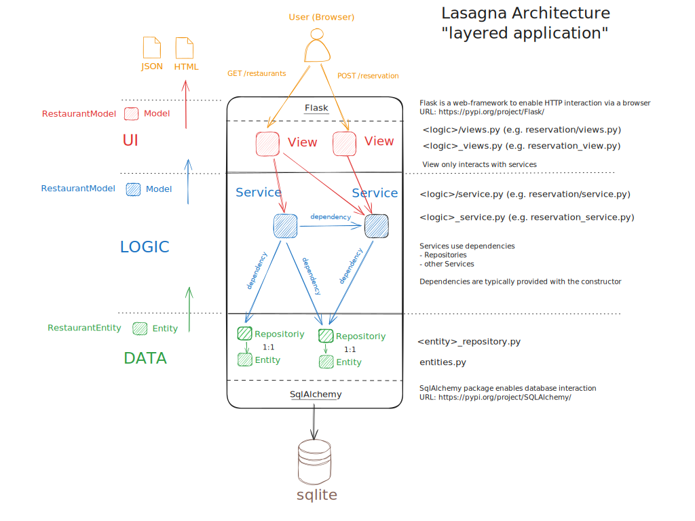

# Software Design Python
This example shows a `typical` python project using Flask as the web-development framework.

## 1. Requirements

### 1.1 Python
What is python?
> Python is an interpreted, object-oriented, high-level programming language with dynamic semantics. 
(https://www.python.org/doc/essays/blurb/)

As this is a python example we need to install it. Systems typically have python installed, but not the most recent version. We are using `python 3.12.x` for this example.

Go to https://www.python.org/downloads/ and download python `3.12.*` for your system (mainly for Windows).

* Windows: Execute the installer as described in the python documentation (https://docs.python.org/3/using/windows.html).
* Mac: Use homebrew `brew install python@3.12`
* Linux: Use your favorite package manager - e.g. ubuntu 24.04 `apt install python3.12 python3.12-venv`

**Windows NOTE**:  When you want to execute python in a `shell` and the Windows App-Store opens, you need to deactivate this Windows-Behavior: https://stackoverflow.com/questions/58754860/cmd-opens-windows-store-when-i-type-python

### 1.2 Shell
Software development needs to interact with the system. Therefor we will encounter an number of CLI (command line interface) tools. To do this effectively we need to use a shell.

In a **Unix-like environments** like Mac/Linux typically a good shell is available out of the box (bash, zsh) in combination with a terminal (terminal, iTerm, Konsole, gnome-terminal, ...). 

For **Windows** a good combination of shell/terminal is [PowerShell](https://github.com/PowerShell/PowerShell)/[Windows Terminal](https://learn.microsoft.com/en-us/windows/terminal/). 

**Powershell**: For windows users it is quite helpful to set the execution-policy for powershell:

```bash
Set-ExecutionPolicy RemoteSigned -Scope CurrentUser
```

**NOTE**: If you use [cmd.exe](https://en.wikipedia.org/wiki/Cmd.exe), you are without help. Nobody should use this old command-interpreter anymore!

## 2. Development
Best practice for any python development is to start with a virtual environment. See how to do in the official python documentation: https://packaging.python.org/en/latest/guides/installing-using-pip-and-virtual-environments/

> You benefit from the virtual environment since packages can be installed confidently and will not interfere with another project’s environment.

**NOTE**: A realtime virus scanning engine like [Windows Defender](https://www.microsoft.com/en-us/windows/comprehensive-security?r=1) sometimes gets in the way during development. As a result common development actions (compilation, execution of scripts, ..) take ages. To speed up the process it can make sense to disable realtime-scanning during compilation or exclude paths in the scan engine (be aware that this has a security impact!)

- [Deactivate Real-Time Scanning](https://support.microsoft.com/en-us/windows/turn-off-defender-antivirus-protection-in-windows-security-99e6004f-c54c-8509-773c-a4d776b77960)
- [Exclude Folder for Scanning](https://support.microsoft.com/en-us/windows/add-an-exclusion-to-windows-security-811816c0-4dfd-af4a-47e4-c301afe13b26)

<hr/>

### 2.1. Create a new virtual environment

```bash
# or just python (depending on the os/system used)
# one typically uses .venv
# either use python or python3
python -m venv <name-of-your-virtual-environment>

# use the environment

# unix-like (linux, mac)
source <name-of-your-virtual-environment>/bin/activate

# windows
.\<name-of-your-virtual-environment>\Scripts\activate

# afterwards your shell shows the activated venv!
```

### 2.2. Install dependencies
We are using the standard python package management tool [pip](https://packaging.python.org/en/latest/guides/tool-recommendations/#installing-packages). There are a couple of other python package managers out there which can be used as well (https://dev.to/adamghill/python-package-manager-comparison-1g98). 

Python has introduced a `standard` way how a python project should be defined (metadata and including dependencies): [pep-0621](https://peps.python.org/pep-0621/) /  [pyproject.toml](https://packaging.python.org/en/latest/guides/writing-pyproject-toml/#writing-pyproject-toml).

The dependencies for this project are defined within the `pyproject.toml` within the `dependencies` section. To install the dependencies the following command is used.

```bash
# install the dependencies
pip install .
# uninstall our app because we are developing it
pip uninstall restaurant_app
```

#### Optional dependencies
To generate class-diagrams from the given project we use `pyreverse` which is part of the [pylint](https://pylint.pycqa.org/en/latest/pyreverse.html) package. The application works without the optional dependency as well!

```bash
# [optional] needed to generate class-diagram
pip install pylint
```

## 3. Powershell based cli
The most often used commands are provided by a powershell script to simplify the execution of the application. Simply start the `cli.ps1` script in a powershell environment.

**NOTE**: it is recommended to use the [modern powershell variant](https://github.com/PowerShell/PowerShell) (formerly known [PSCore](https://learn.microsoft.com/en-us/powershell/scripting/whats-new/differences-from-windows-powershell?view=powershell-7.4)).

If the script is called with the param help, or no param at all, the following information is displayed:

```
./cli.ps1 help

NAME
    ./cli.ps1

SYNOPSIS
    The powershell 'cli.ps1' scipt provides the most-often used commands for this application in a convenient was.


SYNTAX
    ./cli.ps1 [[-Command] <String>] [<CommonParameters>]


DESCRIPTION
    USAGE
        .\cli.ps1 <command>

    COMMANDS
        run                 execute the flask-application via src/run.py
        run-flask           execute the flask-application as a flask-app via flask and --app
        test                run unit-tests of the application via pytest
        class-diagram       generate class-diagrams of the application via pyreverse (output as plantuml)
        db-create           generate the database schema based on the code-first approach through SqlAlchemy
        db-import           import initial data into the database vai ./data/initial_restaurant_data.json
        container-build     create container-image of the application
        container-run       run the application container
        help, -?            show this help message


RELATED LINKS

REMARKS
    To see the examples, type: "Get-Help ./cli.ps1 -Examples"
    For more information, type: "Get-Help ./cli.ps1 -Detailed"
    For technical information, typ
```

## 4. Application structure
The sample application creates a typically layered ("lasagna") architecture. One layer only interacts with another layer via defined interfaces. It should be prevented that layers are skipped. The following picture shows the basic idea:




There is **NO** one/correct approach on how to structure an application. The main goal is to have a structure and follow it and that the chosen structure is understood by the development team. 
```bash
.
├── container                       # Dockerfile and compose file to deploy/run the application in production
├── data                            # Initial data for the application; is used by the cli implementation to load data into db
├── doc                             # Generated and manually created documentation as PlantUML and Markdown files
└── src                             # The python source-code of the application
    └── restaurant_app              # The python module restaurant_app holding the application logic
        ├── auth                    # Authentication logic (very, very simple - not usable for any production!)
        ├── cli                     # The command line interface for the application; mainly commands for the database
        ├── infrastructure          # Basic infrastructure code for the application, config/logging/dependency-injection/cache/...
        ├── reservation             # The reservation logic of the application defines how to reserve a table
        ├── restaurant              # The restaurant logic deals with the basic masterdata of a restaurant
        ├── shared                  # Components and functions used across the application (could be util as well)
        ├── static                  # Static content served via the http server
        │   ├── css                 # Stylesheets
        │   │   └── fonts           # Font-files (bootstrap icons)
        │   ├── img                 # Images used in views
        │   └── js                  # Javascript used in views
        ├── store                   # The entity logic of the application using the ORM framework (SqlAlchemy)
        └── templates               # jinja templates to generate views in HTML
            ├── auth                # Templates used for authentication logic (login)
            └── restaurant          # Templates used for restaurant logic

21 directories
```

## 5. Testing
Tests including coverage-information are performed by invoking the command `./cli.ps1 test` with the following typical output. The example projects opts to put the unit-test files next to the actual logic files and not separate the test-files in a folder calls `test`. Moving the test-files away to a dedicated `test` folder is perfectly OK and is often seen.

```
configfile: pyproject.toml
plugins: cov-5.0.0, typeguard-4.0.1
collected 13 items

src/restaurant_app/infrastructure/memory_cache_test.py ..    [ 15%]
src/restaurant_app/reservation/service_test.py .             [ 23%]
src/restaurant_app/restaurant/service_test.py .              [ 30%]
src/restaurant_app/restaurant/views_test.py ....             [ 61%]
src/restaurant_app/store/menu_repository_test.py .           [ 69%]
src/restaurant_app/store/reservation_repo_test.py ..         [ 84%]
src/restaurant_app/store/restaurant_repository_test.py .     [ 92%]
src/restaurant_app/store/table_repository_test.py .          [100%]
```


   